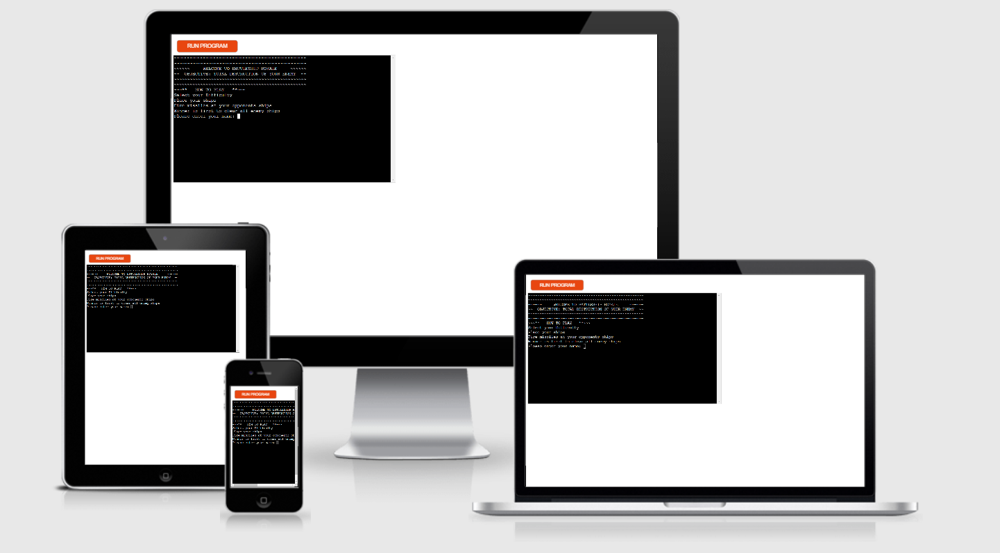
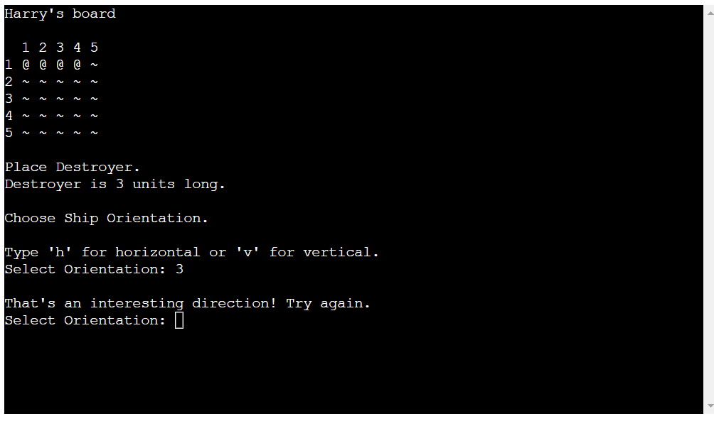

# Battleship Royale

Battleship Royale is a Python terminal based game, that users can play and control with their keybord.

Based on the original Battleship board game, players will fire missiles at their opponents ships in n attempt to sink them all before the enemy sinks all of theirs.

## Gameplay

Player will initially be prompted to add their name before they pick their difficulty level. 
There are 3 difficulties:

- Easy = play area size 5 and 4 ships
- Medium = play area size 7 and 6 ships
- Hard = play area size 9 and 8 ships

Once the difficulty is set, the game boards are generated and the player will be instructed to enter an orientation and start coordinate to place the first ship.  
This will repeat until all player ships are placed. There are checks in place to ensure all inputs are valid and no ships are crashing into eachother. 
The computers board is created identically to the players board except the parameters are generated using a randomising function. The same checks are in place here too.  
Once all the ships are placed, the player will be prompted to guess a location. If the player guesses a location where an enemy ship is located, that location will be marked as a hit and vice-versa for a miss. 
After each player guess and check, the computer will pick a random location using the same randomising function from earlier and use the same checks as the player input. 
The guessing continues until one players ships are all sank. 
The winner is the last one standing.
   
## Features

### Existing Features

- __Difficulty Selection__

  - Allows users to easily choose their desired difficulty.
  - Changes the size of the board and the number of ships in play.
  
  

- __User Input__

  - Multiple points of interaction throughout the game.
  - Allows user to personalise the game with their name.
  - Most fields only requre a single character, making gameplay much faster.
  
  

- __Input Validation__

    - Each input instance is passed through an approprite validation sequence to ensure we send the correct data to the correct place.
    - Certain checks will ask the player to repeat the input until a valid value is passed through.

- __Automated Opponent__

    - The computer opponent is fully automated and will perform all necesary game tasks without player interference.
    - This adds replayability and will keep users engaged for more than one game.

### Features left to Implement

    - Score tracking.
    - 2 player vs mode.
    - "You sunk my..." message on complete removal of ship.

### Technology Used 

    - Github
    - Gitpod
    - Heroku
    - Python

## Testing

- Manual testing was done through devices I own and included my laptop, phone and tablet. I also tested the      deployed app on popular web browsers on my windows laptop. These included Chrome, Firefox, Edge, Opera and  Safari.
- Passed code through a PEP8 linter and it returned no issues.
- Gave invalid inputs, ints when strings are expected, numbers outside of range etc...

## Deployment

- The site was deployed using Heroku and Code Institute's mock terminal. The steps to deploy are as follows: 
  - Fork this repo.
  - Create a new Heroku app
  - Add config var with KEY = PORT and VALUE = 8000
  - Set the buildpacks in the "Settings" section to heroku/python and heroku/nodejs in that order.
  - In the "Deploy" section, link the Heroku app to the Git repo.
  - Click on Deploy

The live link can be found here - https://extreme-battleship-cipp3-hd.herokuapp.com/

## Credits 

- Code Institute for the Heroku terminal
- Stack Overflow for help with data itteration questions.
- Stack Overflow for info on od.system and clearing the interpreter